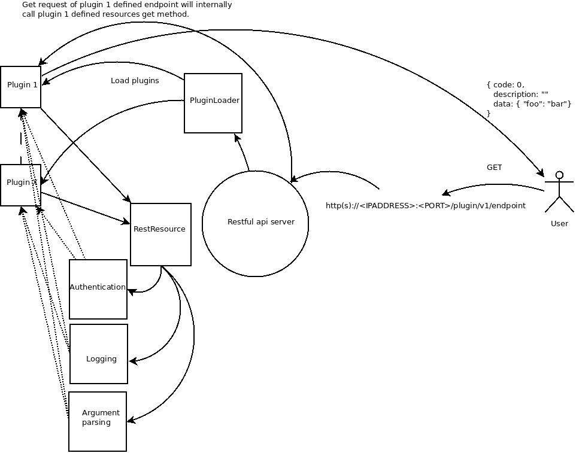

::

   Copyright 2019 Nokia

   Licensed under the Apache License, Version 2.0 (the "License");

   you may not use this file except in compliance with the License.
   You may obtain a copy of the License at

   http://www.apache.org/licenses/LICENSE-2.0

   Unless required by applicable law or agreed to in writing, software
   distributed under the License is distributed on an "AS IS" BASIS,
   WITHOUT WARRANTIES OR CONDITIONS OF ANY KIND, either express or implied.
   See the License for the specific language governing permissions and
   limitations under the License.

=========================================
YARF REST framework
=========================================

:Author: Janne Suominen

.. raw:: pdf

    PageBreak

.. sectnum::

.. contents::

.. raw:: pdf

    PageBreak

Introduction
============

What is REST
------------
**Representational state transfer** (REST) or **RESTful** web services is a way of providing 
interoperability between computer systems on the Internet. REST-compliant Web services allow 
requesting systems to access and manipulate textual representations of Web resources using a 
uniform and predefined set of stateless operations.

About this project
------------------

YARF --- Yet Another Restful Framework

This project provides an implementation for a generic rest framework The
framework is based on
`Flask-RESTful <https://flask-restful.readthedocs.io/en/0.3.5/>`__ 

|  

*The framework provides the following:*

* A generic rest server for whole cloud 

* A plugin based interface for creating rest apis.

|  

*At the high level, the framework serves the following purposes*:

* Provides a unified interface for creating rest interfaces. 

* Single point of entry with plugin based authentication for apis. 

* Define the rest response and query format.

| 

Requirements
------------

* Framework shall provide easy way to integrate new REST apis via plugins

* Framework shall be integrated to the CM and provide means to automatically configure itself

* Framework shall listen to management address of controller on all the controllers

* Framework shall listen to external and internal load balancer address

* Framework shall provide means to configure SSL certification

* Framework shall be integrated to Authentication mechanism provided by the platform

* Framework shall provide means to validate the parameters given as part of the request

* Framework shall return an error code in case of:
    
    * Internal failure; Any failure within the module is considered as internal failure

    * Authentication failure; When authentication has failed or missing credentials

    * Not found; When the object is not found

Structure of data
=================

The implementation of this framework promotes returning JSON format
objects with key value pairs.

Structure of the operation
--------------------------

The framework supports adding function calls for any HTTP requests. The
request can either: 

* Have a request in the body of the message as JSON

* Have a request embedded in the url

Structure of response
---------------------

This framework does not enforce any special structure for the response,
but **it's strongly** encouraged to use the following formatting for the
response:

.. code:: json

     { 
       code: <INT>
       description: <STR>
       data: <DICT>
     }

Where: 

* code is the return value of the api in question. 

  * 0 means no error and anything other is considered as failure 

* description is the description of the possible failure (can be left empty in case there is no failure) 

* data is the data returned by the api. The data should be in dictionary (JSON) format

The reasoning for the quite strict guidelines is: 

* Uniqueness of the response makes it easier for the upper level to check the response

**Note**: The framework will return HTTP status code that is not 200 in
case of: 

* 500: Internal failure (ie. Uncaught exception from the plugin) 

* 401: In case of authentication failure (if authentication is defined)

* 404: In case the object requested is not found

High level architecture of the restful framework
================================================

At the high level, there is a layer built on top of flask-restful to be
able to: 

* Isolation of the framework implementation details. 

* To be able to provide more specific implementation to fit to our needs. 

* To be able to make a single point of entry to the clusters rest api 

* Flexibility to change different parts of the implementation without affecting the users of the framework. 

* Provide unique responses to caller for easy parsing

   architecture

Restful framework interfaces
============================

RestResource
------------

All the plugins have to inherit from this class. This class is the basis
of the plugin framework. All the plugins that inherit from this object
and are defined in plugin specific inifile will be automatically
imported.

The http requests will be converted to corresponding lowercase
functions. For example: request method GET will call *get()* function and
POST will call *post()*.

The resource should also define endpoints where it want's to register
these calls. This is done by setting the *endpoint* class variable list.

For decorating functions with decorators *extra_wrappers* can be used.
The function must return either the function or a dictionary that is of
the same format defined in `Structure of Response`_.

To have authentication for the module adding class variable named
*authentication_method* needs to be defined. For production environment
this should be left untouched since the authentication should be controlled
centrally by the framework.

For logging there is a class variable called *logger* that works like a
normal logger.

An example of a plugin can look like this:

.. _test_rest:
.. code:: python

    class TestRest(RestResource):
        endpoints = ['test'] 
        def get(self):
            self.logger.debug("Got get request")
            return {"code": 0, "description": "", "data": "Foobar"}

Arguments:
~~~~~~~~~~

For parsing the arguments from the message body there function defined in `RestResource`_
called *get_args*. This function will return the arguments that are in the request.
The parser needs to be initialized with *parser_arguments* variable that is a list of
variables your module want's to parse. 

If one needs to define more complex type of an argument it can be done with the help of *RequestArgument*.
This class provides the means of:
    
    * Setting a default value
    
    * Validation of the value by callback function
    
    * The type of the value

When this type of argument is passed as one (or more) of the values. The validation
will be automatically triggered when calling the *get_args* from the *RestResource*.

BaseAuth
--------

This class defines the Base for the authentication.

The class needs to define function *is_authenticated*. The function
gets the request as an argument.

This function will be called when a plugin has specified the
authentication method as a derived class of BaseAuth.

Here is an example of a very simple authentication class.

.. code:: python

    from base_auth import BaseAuthMethod

    class TextBase(BaseAuthMethod):
        def __init__(self):
            super(TextBase, self).__init__()
            self.user = ''
            self.password = ''
            with open('/tmp/foo') as f:
                self.user, self.password = f.read().strip().split(':')

        def is_authenticated(self, request):
            if request.authorization and request.authorization.username == self.user and request.authorization.password == self.password:
                return True
            return False

Keystone
~~~~~~~~

For keystone additional configuration is needed: 

* User with admin role needs to be added (or admin used)

* The config.ini has to contain the credentials and the url of keystone

The following configuration needs to be added to config.ini

.. code:: ini

    [keystone]
    user=restful
    password=foobar
    auth_uri=http://192.168.1.15:5000

After the configuration is done and the authentication will be needed
then the http headers have to contain token with admin privileges as
X-Auth-Token.

Restful framework binary
========================

The framework has only one binary. It's called restapi. The server will
be automatically started during the deployment.

restapi config file
-------------------

The default configuration file for the restful server is located at
/etc/yarf/config.ini

To override the default config file, restapi can be started with command
line parameter --config. This allows testing plugins without
interference to the rest of the system.

The config file contains the following parameters:

.. code:: ini

    [restframe]

    #The port that the restful app will listen DEFAULT:61200
    port=61200
    #The IP address that the restful app will bind to DEFAULT:127.0.0.1
    ip_address=127.0.0.1

    #Use SSL or not
    #If true then private key and certificate has to be also given DEFAULT:False
    use_ssl=false
    #ssl_private_key=PATHTOKEY/KEY.key
    #ssl_certificate=PATHTOCERTIFICATE/CERT.crt

    #The directory where the handlers are 
    #Defaults to /opt/yarf/handlers
    handler_directory=/opt/yarf/handlers

The configuration file will be generated with an ansible module that will configure the framework.
Restapi service will run on all the controllers and listen to the controller internal management IP.
HAProxy will be configured so that clients can take a connection to the internal loadbalancer address 
(or internal VIP) or external loadbalancer address (external VIP). 
The framework will listen to port 61200.

Creating plugins
================

First of all you need to have your own Class defined like the described
in `RestResource`_. The second thing needed is an ini file that describes
the handlers for different requests and the api version of the handler.

The plugins should be placed in their own directory under :

/opt/yarf/handlers.

The thing that needs to be remembered that the object lifetime of *RestResource* is
and will be only the duration of the query. Any data stored by that query that is needed
cannot be stored in the internal variables of the module. This is anyway against the 
*statelessness* nature of rest.

Ini file for plugin
-------------------

The recommendation is to have your own directory (although not mandatory)
per plugin. Within that directory you have to create an inifile that is
of the following format:

.. code:: ini

    [<API_VERSION>]
    handlers=<YOUR_HANDLER>

Where the name of the inifile will the first part of your path on the
rest server. API_VERSION the second And the handler endpoint(s) the
third.

For example if one would create an inifile for the `test_rest`_ resource
it would look like this: testing.ini:

.. code:: ini

    [v1]
    handlers=TestRest

Then if you want to test your api you could do that with curl:

curl http://testing/test/v1/test

.. code:: json

    {
        "code": 0, 
        "description": "u''"
        "data": "u'Foobar'"
    }

There is also a helper to check the apis and their locations:

curl http://testing/test/apis

.. code:: json

    [
      {
        "href": "http://testing/test/v1", 
        "id": "v1"
      } 
    ]

